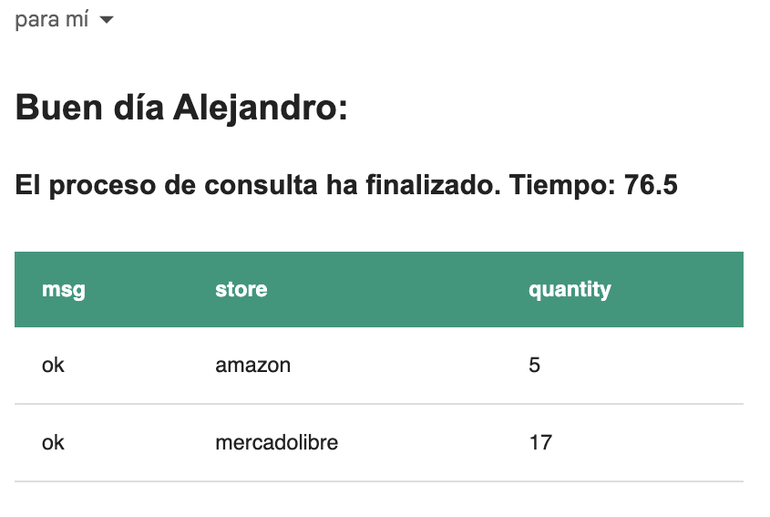

# PROMO HUNT API

Esta API permite a los usuarios obtener información sobre productos relacionados con búsquedas en sitios de comercio electrónico. La API está diseñada para proporcionar una interfaz que permita consultar y acceder a estos datos, con manejo de errores y respuestas HTTP apropiadas tanto en caso de éxito como de fallo.

## Tecnologias utilizadas

- FastAPI
- MongoDB
- Docker
- Playwright
- Selectolax
- Httpx

## Programas necesarios:

- Asegúrate de tener las siguientes versiones:

```bash
python3 --version
# Python 3.11.4
docker --version
# Docker version 24.0.2, build cb74dfc
docker-compose --version
# Docker Compose version v2.19.1
```

## Configurar entorno virtual:

- Crear el entorno virutal

```bash
python3 -m venv venv
```

- Ingresar al entorno virtual:

```bash
source venv/bin/activate
```

- Instalar las librerias:

```bash
pip install -r requirements.txt
```

## Archivo .env

- Copiar el archivo "template.env" a ".env"

```bash
cp template.env .env
```

- Completar los datos del documento

```python
# API
MODE_PROD=False
DEBUG=True
VERSION="0.9.0"
DEV_URL="/"
PROD_URL="/"
ALLOWED_HOSTS=["*"]
WORKERS=1
PROD_PORT=8035
# DATABASE
DATABASE_HOSTNAME="mongodb"
DATABASE_PORT=27017
DATABASE_PASSWORD="Complex123*"
DATABASE_USERNAME="mongo"
DATABASE_WEB_USER="user"
DATABASE_WEB_PASSWORD="pass"
# EMAIL
EMAIL_SENDER=""
EMAIL_PASSWORD=""
# PLAYWRIGHT
PLAYWRIGHT_HEADLESS=True
PLAYWRIGHT_SANDBOX=False
CHUNK_SIZE=1
TIMEOUT=6000
```

Nota:

- Los campos EMAIL_SENDER y EMAIL_PASSWORD son necesarios para la conexión SMTP de correo electrónico. La aplicación se probó utilizando Gmail.

## Inicializar la aplicación:

- Asegúrate de tener Docker instalado:

```bash
docker --version
# Docker version 24.0.2, build cb74dfc
docker-compose --version
# Docker Compose version v2.19.1
```

- Crear la imagen de Docker

```bash
docker-compose -f develop.yml build
```

- Iniciar el contenedor de Docker

```bash
docker-compose -f develop.yml up
```

## Funcionamiento de la aplicación:

A continuación se detalla el funcionamiento de la aplicación.

### ¿Qué es PromoHuntAPI?

Es una API construida con FastAPI que ofrece endpoints relacionados con la búsqueda y el análisis de productos en sitios de comercio electrónico.

A continuación de brinda el detalle para hacer uso de la aplicación.

Ingresar a la url: [localhost:8000](http://localhost:8000) para la API.

Ingresar a la url: [localhost:8081](http://localhost:8081) para visualizar la base de datos mongo (las claves web estan en el archivo develop.yml).

### 1. Creación de usuario

- Se cuenta con los siguientes endpoints para Users:

  

- Ingresar al endpoint "POST create a new user", para crear el user_id se requiere el correo electrónico y un nombre.

  

- Al crear el usuario, se le asignará un user_id.

  

### 2. Creación de busqueda

- Se cuenta con los siguientes endpoints:

  

- Para crear una busqueda se utiliza el endpoint POST /apiv1/search/, es necesario agregar el producto que se quiere buscar junto con el user_id para notificar.

  

- Al crear la busqueda recibirá el search_id para hacer seguimiento desde la base de datos

  

- Desde la base de datos se puede visualizar el proceso y avances.

  

- Se puede visualizar en la base de datos cuando el proceso haya finalizado.

  

- Al finalizar el proceso de creación de busqueda recibirá un email

  

- En la base de datos el documento resultante va a contener la información de la consulta.

  

```python
# Documento de la consulta
{
    _id: ObjectId('64ec2fa90553308c27f53012'),
    search_proyect: 'monitor 4k oled curved',
    status: 'finished',
    user_id: '64eb77d8008278db06caf636',
    products: [
        {
            url: 'https://articulo.mercadolibre.com.co/',
            title: 'Monitor LG Ultragear 45gr95qe-b Oled 3440x1400, 21:9, 240hz',
            brand: 'marca',
            ratings: 'ratings',
            description: 'description',
            product_id: '64ec2fac0553308c27f53013',
            price: [
                {
                    price: 9950000,
                    date: ISODate('2023-08-28T05:25:00.802Z')
                }
            ],
            ecommerce: 'mercadolibre'
        },
    ],
    stores: [
        {
            amazon: 'finished'
        },
        {
            mercadolibre: 'finished'
        }
    ]
}
```

### 3. Realizar seguimiento

Para rastrear productos y determinar si han disminuido de precio, sigue estos pasos:

- En el endpoint de seguimiento se utilizará el search_id.

  

- El proceso se iniciará en segundo plano y obtendra una respuesta similar.

  

- Una vez finalizado el proceso de búsqueda, se enviará un correo electrónico.

  

- El documento de la búsqueda se actualizará con el valor del precio y la fecha/hora de la nueva consulta.

  

### 4. Pruebas de la aplicación

Se implemento pytest para las pruebas unitarias

```python
pytest -v
```


Nota: Se realizaron algunas pruebas, aunque no se completaron para el 100% de la aplicación.

## ¿Qué quedo pendiente?

Una de las funcionalidades pendientes es la capacidad de rastrear productos y notificar si sus precios bajan. Esta función aún no está activa.

Además, está pendiente la posibilidad de eliminar productos de seguimiento y aquellos cuyos precios estén fuera de los rangos establecidos por el usuario.

Espero poder completar estas características en futuras actualizaciones.
